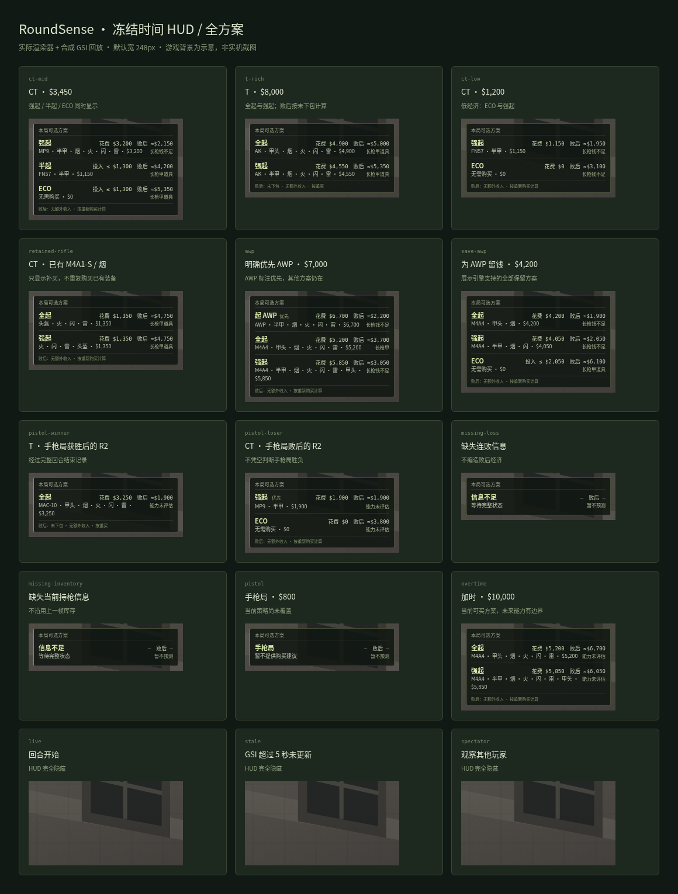

# 冻结时间 HUD

HUD 默认宽 248 CSS px，纵向展示 Policy V3 返回的**所有方案**。普通三个方案约 158px 高，长购买清单换行而不截断。第一行是方案、实际花费或投入边界、败后现金；第二行是完整补买清单、实际花费和未来购买能力。没有人为选定的默认方案，只有引擎明确给出优先项时才标注。

默认放在雷达下方，可以在局外设置页选择左下、右下、缩放和透明度。窗口跟随前台 CS2 客户区定位，支持负坐标显示器和 DPI 缩放。透明、无边框、置顶、鼠标穿透、不抢焦点、不出现在任务栏。切出游戏或最小化时隐藏。

## Windows 使用

需要项目已有的 Node 24 / pnpm 环境，以及 [Tauri Windows 构建环境](https://v2.tauri.app/start/prerequisites/#windows)：Rust stable、MSVC C++ Build Tools 和 WebView2。命令从仓库根目录运行。

```powershell
pnpm install --frozen-lockfile
pnpm desktop:build

# 先查看旧配置；不会打印 token，也不修改配置。
powershell -ExecutionPolicy Bypass -File scripts/windows/gsi-config.ps1 -Action Status

# 用显式文件写入，避免 Windows PowerShell 重定向产生 UTF-16 配置。
pnpm hud --cfg --cfg-out roundsense.cfg > $null
powershell -ExecutionPolicy Bypass -File scripts/windows/gsi-config.ps1 -Action Install -Source roundsense.cfg
```

重启 CS2，使其读取配置。停掉占用 3001 端口的旧 CLI / recorder，再启动服务：

```powershell
pnpm hud
```

保持这个终端运行，在第二个终端启动桌面程序：

```powershell
& .\apps\desktop\src-tauri\target\release\roundsense-desktop.exe
```

设置页随程序打开，关闭设置窗口会退出桌面程序。结束 `pnpm hud` 会使建议立即隐藏；桌面程序和后端分别停止。浏览器打开 `http://127.0.0.1:3100/` 也可以调整设置，但浏览器本身不具备局内覆盖能力。原生窗口固定连接 3100；其他 web 端口仅用于浏览器调试。

配置文件、持久 token 和展示偏好保存在 `%LOCALAPPDATA%\RoundSense`。备份在其 `gsi-backups` 子目录。生成的 `roundsense.cfg` 含有本机 token，已加入 gitignore。

## 原来残留的 GSI

工具从 Steam 注册表与 `libraryfolders.vdf` 查找 CS2 安装位置，列出各个 `gamestate_integration_*.cfg` 的文件名和脱敏 endpoint。只有 `gamestate_integration_roundsense.cfg` 属于本工具：安装前备份旧内容，以 UTF-8 无 BOM 写入 1 秒心跳版本。重复安装仍保留第一次安装前的原文件。其他工具（包括 Mizar）的文件保留；若也指向 RoundSense 端口，会提示重复来源。

多个安装目录或自动发现失败时，给每个命令增加 `-CfgDirectory 'D:\SteamLibrary\steamapps\common\Counter-Strike 2\game\csgo\cfg'`。恢复命令：

```powershell
powershell -ExecutionPolicy Bypass -File scripts/windows/gsi-config.ps1 -Action Restore
```

恢复旧文件；如果此前没有文件，只删除本次创建的 RoundSense 文件。安装后手动改过的内容不会被覆盖。当前开发环境无法检查你 Windows 上真实残留的文件，第一次运行 `Status` 后才能确认。

## 数据和显示边界

- 仅普通玩家 competitive 模式、本人的 GSI、地图 live、明确 freezetime 时显示；进行中、结束、热身、观战和菜单状态隐藏。
- 5 秒没有 GSI 更新就失效；SSE 断开或 2 秒无本地心跳时渲染器隐藏；原生宿主的 3 秒租约还能在 WebView 卡住时隐藏窗口。
- 断序、时间倒退、身份改变和过期后恢复都会重置连续历史。不会凭空恢复手枪局胜负。不会用旧帧库存代替缺失的当前库存。
- 手枪局暂未提供购买策略；状态不完整时只展示信息不足，不输出虚构金额。
- 败后按无额外收入、重新购买计算；T 按未下包。手枪局后 / 加时的未来购买能力可能未评估，以引擎边界为准。HUD 不提供尚未校准的 C4 倒计时。
- 不向 UI 提供原始 payload、SteamID 或 GSI token。服务仅监听 loopback，GSI 校验 token，设置写入校验 Origin 与 Host。

窗口方案参考了 [Mizar](https://github.com/Starfie1d1272/Mizar) 的透明覆盖、前台检测、鼠标穿透，以及状态新鲜度管理的思路；实现独立编写，没有复制其代码，也没有引入其观察者 GSI 字段。

## 截图与验证

[全部情境截图](screenshots/hud/scenarios.png) · [默认局内位置示意](screenshots/hud/ct-mid-full.png) · [设置页](screenshots/hud/settings.png)



截图使用**真实 HUD 渲染器和真实 GSI HTTP 接收链路**，输入是合成普通玩家状态；游戏背景是示意，**不是 Windows CS2 实机截图**。包含 CT 中等 / 低经济、T 富裕经济、保枪补买、两种 AWP 偏好、手枪局后胜负、缺失信息、手枪局、加时及三种隐藏情境。对应的完整派生输出保存在 `screenshots/hud/snapshots.json`。

复现截图（请勿同时运行正式 HUD 或连接正在玩的 CS2）：

```sh
pnpm exec tsx scripts/hud-scenarios.ts
# 另一个终端；需要 Python playwright 和 Chromium。
# 可通过 CHROMIUM_PATH 指定浏览器，否则使用 /usr/bin/chromium 或 Playwright 安装的浏览器。
python scripts/capture-hud.py
```

该 QA 程序额外在 3201 暴露本机情境切换，正式 HUD 不包含这个 endpoint。原有 `pnpm panel:preview` 是此前的单方案设计探索，正式界面以 `pnpm hud` 和本页截图为准。

自动验证覆盖 HUD 语义、真实 HTTP/SSE、设置校验、窗口坐标以及配置的重复安装、精确恢复、新建删除、外部修改保护与其他工具保留。CI 增加 Windows 原生构建。**原生前台检测、焦点、鼠标穿透、不同 DPI 与 CS2 显示模式仍需 Windows 实机验收**；优先用无边框窗口模式，独占全屏需实际确认。
